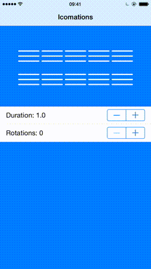

Icomations
====

Swifty hamburger animations



Basic Usage
========

See example project for a demo.

Import Icomation.swift in your project. Add a button to your view via Interface Builder, change the class to Icomation in the Identity Inspector and connect an outlet to it. Or create a new Icomation in code
```swift
var icomation = Icomation(frame: CGRectMake(0, 0, 50, 50))
view.addSubview(icomation)
```

Set a type
```swift
icomation.type = IconType.ArrowUp
```

Choose a color for each segment (default is white)
```swift
icomation.topShape.strokeColor = UIColor.redColor().CGColor
icomation.middleShape.strokeColor = UIColor.blueColor().CGColor
icomation.bottomShape.strokeColor = UIColor.blackColor().CGColor
```

Set a duration for the animation
```swift
icomation.animationDuration = 1.0
```

Set the number of rotations for the animation
```swift
icomation.numberOfRotations = 3
```